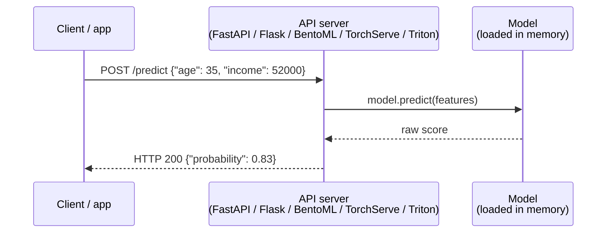
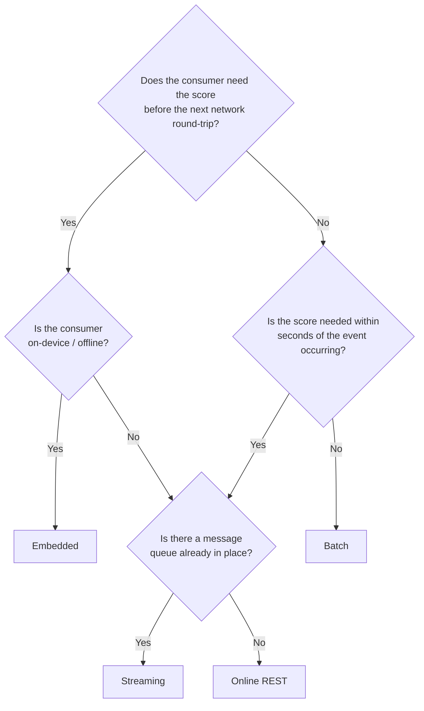

# Day 2 — MLOps in Production

> Hands-on companion: [day2_practice.ipynb](day2_practice.ipynb)

## Goals for Day 2

By the end of today, you will be able to:

1. **Package** a trained model and serve it behind a REST API.
2. Containerize the service for portable deployment.
3. Design a **CI/CD pipeline for ML** (testing data, code, and models).
4. Monitor a model in production and detect **data and concept drift**.
5. Apply industry best practices around **governance, security, and team structure**.

Recap from Day 1: [day1_materials.md](../day1/day1_materials.md).

---

## Module 5 — Packaging & Serving Models (09:00 – 10:30)

### 5.1 The packaging problem

A trained model in memory is useless in production. We need a **portable artifact** that another process (often on another machine) can load and call.

Common artifact formats:

| Format | Notes |
|--------|-------|
| `pickle` / `joblib` | Easy in Python; security risk if deserializing untrusted files; tied to library versions. |
Pickle is a module from the Python Standard Library. It can serialize any Python object, including custom Python classes and objects.

joblib is more efficient than pickle when working with large machine learning models or large numpy arrays.

| **ONNX** | Cross-framework, runtime-optimized inference. |
ONNX is an open format built to represent machine learning models. ONNX defines a common set of operators - the building blocks of machine learning and deep learning models - and a common file format to enable AI devleopers to use models with a variety of frameworks, tools, runtimes, and compilers.

It holds the architecture and parameters i.e. "weights". It makes it easy to move a model between frameworks.

| **TorchScript** / SavedModel | Framework-native, production-grade. |

A subset of Python that allows developers to create serializable, optimizable,  and production-ready models from PyTorch code.

It enables executing deep learning models in high performance environments without requiring a Python runtime.

Use when there are no Python dependencies, such as running models on mobile devices, edge computing platforms, or in C++ inference servers.

Trims overheads associated with the Python interpreter, allowing for faster inference times and hardware-level optimisations.

Saves entire model architectures, weights, and logic into a single .pt or .pth file.


| **MLflow Model** | Wraps any of the above with metadata + signature. |


### 5.2 Model signature & schema

A model should declare what it accepts and returns:

```yaml
inputs:
  - {name: age,    type: long}
  - {name: income, type: double}
outputs:
  - {name: prob,   type: double}
```

This catches "the API sent a string where the model expected an int" **before** it crashes silently.

#### Where is this file stored?

This YAML is the `MLmodel` file — the metadata manifest that MLflow writes automatically every time you call `mlflow.<flavor>.log_model()`. It lives **inside the logged model artifact directory**, which MLflow creates in the run's artifact store:

```
mlruns/
└── <experiment_id>/
    └── <run_id>/
        └── artifacts/
            └── model/           ← the model artifact directory
                ├── MLmodel      ← ← THIS FILE (the signature YAML + metadata)
                ├── model.pkl    ← the serialised model (for sklearn)
                ├── requirements.txt
                ├── conda.yaml
                └── python_env.yaml
```

In a real deployment the artifact store is usually object storage (S3, GCS, Azure Blob) rather than the local filesystem, but the directory layout is identical.

You can inspect it for any logged run with:

```bash
cat mlruns/<experiment_id>/<run_id>/artifacts/model/MLmodel
```

A full example looks like:

```yaml
artifact_path: model
flavors:
  python_function:
    env:
      conda: conda.yaml
      virtualenv: python_env.yaml
    loader_module: mlflow.sklearn
    model_path: model.pkl
    predict_fn: predict
    python_version: 3.11.9
  sklearn:
    code: null
    pickled_model: model.pkl
    serialization_format: cloudpickle
    sklearn_version: 1.4.2
mlflow_version: 2.12.1
model_uuid: 8f3c2a1b...
run_id: 4e9d7f23...
saved_input_example_info: null
signature:
  inputs: '[{"name": "age", "type": "long"}, {"name": "income", "type": "double"}]'
  outputs: '[{"name": "prob", "type": "double"}]'
utc_time_created: '2024-06-07 09:14:22.103'
```

#### How is the signature used?

**1. At log time — inferred automatically or provided explicitly:**

```python
from mlflow.models import infer_signature

# MLflow inspects X_train and predictions to build the signature for you
signature = infer_signature(X_train, model.predict(X_train))

mlflow.sklearn.log_model(model, "model", signature=signature)
```

Alternatively, define it explicitly when the auto-inferred types are wrong:

```python
from mlflow.types.schema import Schema, ColSpec
from mlflow.models.signature import ModelSignature

signature = ModelSignature(
    inputs=Schema([ColSpec("long", "age"), ColSpec("double", "income")]),
    outputs=Schema([ColSpec("double", "prob")]),
)
```

**2. At load / serve time — enforced on every request:**

When you serve the model with `mlflow models serve` or load it with `mlflow.pyfunc.load_model()`, MLflow reads the `MLmodel` signature and **validates every input** against it before passing data to the model:

```python
model = mlflow.pyfunc.load_model("runs:/<run_id>/model")

# This raises MlflowException if types don't match the signature
model.predict(pd.DataFrame({"age": ["thirty"], "income": [50000.0]}))
# → MlflowException: Failed to enforce schema ...
```

The CLI serving path does the same thing automatically:

```bash
mlflow models serve -m "runs:/<run_id>/model" --port 5001
# POST /invocations with wrong types → 400 Bad Request with a clear error message
```

**3. In the Model Registry — for governance and compatibility checks:**

When a model is promoted in the Model Registry (Staging → Production), the signature is compared against the previous version. If the input schema changed (e.g. a column was renamed or its type changed), the registry can flag the incompatibility before it reaches production and breaks a downstream service.

#### Signatures and metadata beyond MLflow

The pattern — declare types at save time, validate at load/serve time, inspect for governance — is not MLflow-specific. It appears across the ML ecosystem in different forms.

---

##### ONNX

Every `.onnx` file embeds typed input/output tensor specs directly in the binary. The ONNX runtime reads them before any inference and rejects mismatched inputs.

```python
import onnxruntime as rt

sess = rt.InferenceSession("model.onnx")

# Inspect the signature embedded in the file
for inp in sess.get_inputs():
    print(inp.name, inp.type, inp.shape)
# → age   tensor(int64)   [None, 1]
# → income tensor(float)  [None, 1]

# Runtime enforces types: passing a string raises OrtInvalidArgument
scores = sess.run(None, {"age": age_array.astype("int64"),
                          "income": income_array.astype("float32")})[0]
```

Converting from sklearn to ONNX also forces you to declare types explicitly, which catches train/serve skew at export time rather than at runtime:

```python
from skl2onnx import convert_sklearn
from skl2onnx.common.data_types import Int64TensorType, DoubleTensorType

# The type annotation here IS the signature
onnx_model = convert_sklearn(
    model, "churn",
    initial_types=[
        ("age",    Int64TensorType([None, 1])),
        ("income", DoubleTensorType([None, 1])),
    ]
)
```

---

##### TensorFlow SavedModel

A TensorFlow `SavedModel` stores named *serving signatures* inside `saved_model.pb`. TF Serving reads these at startup and uses them to route and validate incoming HTTP/gRPC requests.

```python
import tensorflow as tf

# At save time: attach a named signature with typed inputs/outputs
@tf.function(input_signature=[
    tf.TensorSpec(shape=[None], dtype=tf.int64,   name="age"),
    tf.TensorSpec(shape=[None], dtype=tf.float32, name="income"),
])
def serve(age, income):
    return {"prob": model([age, income])}

tf.saved_model.save(model, "saved_model/", signatures={"serving_default": serve})
```

```bash
# Inspect the signature without loading the model
saved_model_cli show --dir saved_model/ --tag_set serve --signature_def serving_default
# → The given SavedModel SignatureDef contains the following input(s):
#   inputs['age']    tensor_info: dtype: DT_INT64, shape: (-1)
#   inputs['income'] tensor_info: dtype: DT_FLOAT,  shape: (-1)
# → The given SavedModel SignatureDef contains the following output(s):
#   outputs['prob']  tensor_info: dtype: DT_FLOAT,  shape: (-1)
```

TF Serving rejects requests that don't match these specs with a clear gRPC or HTTP 400 error — the same guarantee MLflow's signature enforcement provides.

---

##### Triton Inference Server

NVIDIA's Triton Inference Server uses a `config.pbtxt` file per model. This file is the "signature" for Triton: it declares input/output names, dtypes, and shapes and Triton enforces it at the HTTP/gRPC layer before the request reaches any backend.

```protobuf
# models/churn/config.pbtxt
name: "churn"
backend: "onnxruntime"

input [
  { name: "age"    data_type: TYPE_INT64  dims: [ -1, 1 ] },
  { name: "income" data_type: TYPE_FP32   dims: [ -1, 1 ] }
]
output [
  { name: "prob"   data_type: TYPE_FP32   dims: [ -1, 1 ] }
]

# Triton batches requests automatically up to this size
dynamic_batching { max_queue_delay_microseconds: 100 }
```

A request with a wrong dtype or unexpected field name returns an error before any GPU compute is used — which matters when GPU time is expensive.

---

##### BentoML

BentoML uses Python type annotations and `pydantic` schemas as the service signature. Unlike MLflow, the signature lives in code rather than in a YAML file, which makes it easier to version alongside the model logic.

```python
import bentoml
from bentoml.io import NumpyNdarray, PandasDataFrame

# The input/output specs ARE the signature — checked at every /predict call
svc = bentoml.Service("churn_svc", runners=[runner])

@svc.api(input=PandasDataFrame(), output=NumpyNdarray())
def predict(df: pd.DataFrame) -> np.ndarray:
    return runner.predict.run(df)
```

BentoML generates an OpenAPI spec from these annotations automatically, so the signature also drives the interactive API docs (`/docs`).

---

##### PMML — a portable, governance-focused signature format

**PMML (Predictive Model Markup Language)** is an XML standard for exporting models across tools. Unlike the formats above, it is not primarily a runtime enforcement mechanism — it is an *interchange and governance format*. The schema is part of the file, but the purpose is auditability and portability.

```xml
<!-- churn_model.pmml — readable by SAS, IBM, Spark MLlib, and others -->
<PMML version="4.4" xmlns="http://www.dmg.org/PMML-4_4">
  <Header copyright="DSR 2024"/>
  <DataDictionary numberOfFields="3">
    <DataField name="age"    optype="continuous" dataType="integer"/>
    <DataField name="income" optype="continuous" dataType="double"/>
    <DataField name="prob"   optype="continuous" dataType="double" usage="predicted"/>
  </DataDictionary>
  <!-- model weights, tree structure, or regression coefficients follow -->
</PMML>
```

PMML is common in financial services and insurance where:
- Regulators demand that models be interpretable in a vendor-neutral format.
- The scoring engine is not Python (e.g. a bank's SAS or COBOL-based production system).
- Audit trails require that the exact model specification, not just weights, be stored and versioned.

```python
# Export from sklearn → PMML (via sklearn2pmml)
from sklearn2pmml import sklearn2pmml
from sklearn2pmml.pipeline import PMMLPipeline

pipeline = PMMLPipeline([("classifier", model)])
pipeline.fit(X_train, y_train)
sklearn2pmml(pipeline, "churn_model.pmml")
```

---

##### Model Cards and Hugging Face `config.json` — metadata for governance

**Model Cards** (developed by Google, adopted by Hugging Face) are structured metadata documents attached to model artifacts. They do not enforce runtime types — their role is *human and organisational governance*: who built this, what data it was trained on, what it should and should not be used for, and how it performs across demographic groups.

A minimal model card:

```markdown
## Model Card — Churn Classifier v2

**Intended use:** predict 30-day churn probability for consumer accounts.
**Out-of-scope uses:** not validated for business accounts or non-EU markets.

**Training data:** anonymised transaction logs 2021–2023. No special category data.
**Evaluation:** AUC 0.91 on holdout. AUC by age group: 18–30 → 0.89, 31–60 → 0.93, 60+ → 0.87.

**Known limitations:** performance degrades for accounts < 3 months old (sparse features).
**Owner:** @alice  |  **Approved by:** @head-of-risk  |  **Review date:** 2025-01-01
```

The EU AI Act (2024) makes model cards or equivalent documentation mandatory for high-risk AI systems.

**Hugging Face `config.json`** is the metadata manifest for transformer models. It records architecture choices (number of layers, attention heads, vocabulary size, tokenizer class) that the `transformers` library reads to reconstruct the model class automatically — similar to how MLflow's `MLmodel` records the flavor and serialization format.

```json
{
  "architectures": ["BertForSequenceClassification"],
  "hidden_size": 768,
  "num_attention_heads": 12,
  "num_hidden_layers": 12,
  "num_labels": 2,
  "id2label": {"0": "not_churn", "1": "churn"},
  "model_type": "bert"
}
```

```python
# transformers reads config.json to know which class to instantiate
from transformers import AutoModelForSequenceClassification
model = AutoModelForSequenceClassification.from_pretrained("my-churn-bert/")
# → no need to specify BertForSequenceClassification manually
```

---

##### How these fit together

| Format / tool | Primary role | Runtime enforcement? | Governance use? |
|---------------|-------------|---------------------|----------------|
| **MLflow `MLmodel`** | Experiment tracking + serving | Yes — rejects bad inputs | Partial (registry) |
| **ONNX** | Cross-framework portability + inference | Yes — type checked by runtime | No |
| **TF SavedModel** | TensorFlow production serving | Yes — TF Serving enforces | No |
| **Triton `config.pbtxt`** | GPU inference server | Yes — enforced at HTTP/gRPC layer | No |
| **BentoML service spec** | Python-native serving | Yes — Pydantic validation | Partial (OpenAPI docs) |
| **PMML** | Vendor-neutral interchange | Depends on scoring engine | Yes — audit/compliance |
| **Model Cards** | Governance and communication | No | Yes — primary purpose |
| **HuggingFace `config.json`** | Model reconstruction | Partial (class selection) | Partial |

The key distinction: **runtime enforcement** (ONNX, TF SavedModel, MLflow, Triton) and **governance metadata** (PMML, Model Cards) are complementary, not alternatives. A production system typically needs both: the serving layer rejects malformed requests, and the governance layer answers "who approved this model and on what data?"

---

#### Summary

| When | What happens |
|------|-------------|
| `mlflow.<flavor>.log_model(..., signature=sig)` | Signature written into `MLmodel` in the artifact store |
| `mlflow.pyfunc.load_model(uri)` | `MLmodel` is read; schema loaded into memory |
| `.predict(df)` | Input DataFrame validated against signature before model sees it |
| `mlflow models serve` | Same validation, but over HTTP — bad requests return 400 |
| Model Registry promotion | Signatures between versions can be compared for breaking changes |

### 5.3 Serving patterns

| Pattern | When to use |
|---------|-------------|
| **Batch** (offline scoring, write to DB) | Daily recommendations, monthly risk scoring. |
| **Online / real-time REST/gRPC** | Latency-sensitive (fraud, search, ads). |
| **Streaming** | Continuous event scoring (Kafka, Flink). |
| **Embedded / on-device** | Mobile, IoT — use ONNX, TFLite, CoreML. |

#### Pattern 1 — Batch scoring

The model runs as a scheduled job. It reads a table of entities that need scores, runs `model.predict()` on all of them, and writes results back to a database or object storage. Nothing serves predictions in real time.

```
┌──────────────┐   read    ┌───────────┐  predict  ┌─────────────────┐
│  Source DB / │ ────────▶ │  Scoring  │ ────────▶ │  Output table   │
│  data lake   │           │   job     │           │  (scores, ts)   │
└──────────────┘           └───────────┘           └─────────────────┘
        ▲                        │
        │                  triggered by
        │                  Airflow / cron
```

**Typical setup:**

```python
# batch_score.py — run daily via Airflow or cron
import pandas as pd, joblib, sqlalchemy

model = joblib.load("model.pkl")                        # or mlflow.pyfunc.load_model(...)
engine = sqlalchemy.create_engine(os.environ["DB_URL"])

df = pd.read_sql("SELECT * FROM customers WHERE scored_at IS NULL", engine)
df["score"] = model.predict_proba(df[FEATURE_COLS])[:, 1]
df[["customer_id", "score"]].to_sql("scores", engine, if_exists="append", index=False)
```

**Trade-offs:**
- Simple to build and operate — it's just a Python script with a scheduler.
- No latency requirements; you can score millions of rows overnight.
- Scores go stale — the prediction was made hours ago and may not reflect the current state of the entity.
- Works well when the downstream consumer (e.g. a marketing tool) pulls scores on a fixed cadence.

---

#### Pattern 2 — Online / real-time REST

The model is wrapped in an HTTP server that another service can call synchronously. The caller sends features in the request body and gets a prediction back in the response, typically within tens of milliseconds.



**Typical setup (FastAPI — see 5.4 for full example):**

```bash
# Build the image once, run anywhere
docker build -t churn-svc:1.0 .
docker run -p 8000:8000 -e MODEL_PATH=s3://... churn-svc:1.0
```

The model is loaded **once at startup** and kept in memory. Every request hits the already-loaded model — no disk I/O per request.

**Scaling:** put the container behind a load balancer (Kubernetes `Deployment` + `HorizontalPodAutoscaler`). Each pod has its own copy of the model in memory. For very large models (LLMs, vision transformers), use a specialised inference server like **Triton** or **TorchServe** that supports GPU batching and model sharding.

**Trade-offs:**
- The application blocks waiting for the response — low latency matters.
- You pay for an always-on server even during idle periods.
- Model updates require a rolling pod restart (or a blue/green deploy).

---

#### Pattern 3 — Streaming

Events arrive on a message queue (Kafka, Kinesis, Pub/Sub) and are scored as they flow through. The model is embedded inside a stream-processing job that consumes the topic, runs inference, and publishes results to an output topic.

```
 Events                Scoring job               Scored events
 ──────▶  Kafka topic ──▶  Flink / Spark  ──▶  Kafka topic ──▶ downstream
           (raw)            Streaming             (with scores)
                            (model loaded
                             in memory)
```

**Typical setup (Flink Python API sketch):**

```python
# flink_score.py
import joblib
from pyflink.datastream import StreamExecutionEnvironment
from pyflink.common.serialization import SimpleStringSchema

env = StreamExecutionEnvironment.get_execution_environment()
model = joblib.load("model.pkl")   # loaded once per task manager process

def score(event_json: str) -> str:
    event = json.loads(event_json)
    features = [[event["age"], event["income"]]]
    prob = model.predict_proba(features)[0, 1]
    return json.dumps({**event, "score": prob})

stream = (
    env.add_source(kafka_source("raw-events"))
       .map(score)
       .add_sink(kafka_sink("scored-events"))
)
env.execute()
```

**Trade-offs:**
- Scores are available within milliseconds of the event arriving — no polling, no stale data.
- Model updates require redeploying the Flink/Spark job and restarting the pipeline.
- Operationally heavier: you need a running Kafka cluster and a stream processor.
- Best for use cases where something else reacts to the score immediately (e.g. fraud block, real-time personalisation feed).

---

#### Pattern 4 — Embedded / on-device

The model runs **inside the client application** — a mobile app, a browser, an edge device — with no network call. This requires converting the model to a format with a lightweight runtime.

```
 ┌───────────────────────────────┐
 │   Mobile app / IoT firmware   │
 │                               │
 │   raw input ──▶  TFLite /     │
 │                  ONNX runtime │
 │                  ──▶ score    │
 │                               │
 │   (no network required)       │
 └───────────────────────────────┘
```

**Typical export pipeline:**

```python
# 1. Train in sklearn / PyTorch / TensorFlow as usual
model.fit(X_train, y_train)

# 2a. Export to ONNX (works from sklearn, PyTorch, XGBoost, etc.)
import skl2onnx
from skl2onnx.common.data_types import FloatTensorType
onnx_model = skl2onnx.convert_sklearn(
    model, "churn", [("input", FloatTensorType([None, X_train.shape[1]]))]
)
with open("model.onnx", "wb") as f:
    f.write(onnx_model.SerializeToString())

# 2b. Export to TFLite (from TensorFlow/Keras)
converter = tf.lite.TFLiteConverter.from_keras_model(keras_model)
tflite_model = converter.convert()
open("model.tflite", "wb").write(tflite_model)
```

**Runtime on-device (ONNX Runtime, universal):**

```python
import onnxruntime as rt
sess = rt.InferenceSession("model.onnx")
input_name = sess.get_inputs()[0].name
scores = sess.run(None, {input_name: X_new.astype("float32")})[0]
```

**Trade-offs:**
- Zero latency, works offline, no server cost.
- Model size is constrained (phones, microcontrollers). Apply quantisation (`INT8`) or pruning to shrink.
- **Model updates are hard**: you must ship a new app version or use an over-the-air update mechanism. Users on old app versions run old models.
- Not all model types translate cleanly to ONNX/TFLite — custom layers or dynamic control flow may require manual export effort.

---

#### Choosing a pattern



### 5.4 A minimal online service (FastAPI)

**Why FastAPI in MLOps?**

**FastAPI** is a modern Python web framework used to wrap a trained model behind an HTTP API so other systems can request predictions over the network. In MLOps it serves as the "last mile" — the bridge between a model sitting in a file and a production application that needs real-time answers. You send a JSON request with input features, and the API returns the model's prediction. FastAPI is popular because it's fast, auto-generates API docs, and uses Pydantic for input validation (catching bad requests before they reach the model).

```python
from fastapi import FastAPI
from pydantic import BaseModel
import joblib

app = FastAPI()
model = joblib.load("model.joblib")

class Features(BaseModel):
    mean_radius: float
    mean_texture: float
    # ... etc

@app.post("/predict")
def predict(f: Features):
    proba = model.predict_proba([[f.mean_radius, f.mean_texture]])[0, 1]
    return {"probability": float(proba)}

@app.get("/health")
def health():
    return {"status": "ok"}
```

Best practice endpoints:

| Endpoint | Purpose |
|----------|---------|
| `GET /health` | Liveness — am I alive? |
| `GET /ready` | Readiness — model loaded, deps reachable? |
| `POST /predict` | Inference |
| `GET /metrics` | Prometheus exposition format |

### 5.5 Containers

Packaging the service in a container image gives you **one reproducible artifact** that runs identically on your laptop, a CI server, and a Kubernetes pod. You stop hearing "but it worked on my machine".

#### The Dockerfile

A Dockerfile is a recipe: start from a base image, add layers, declare how the container starts.

```dockerfile
# Build from the repo root (see "build context" below):
#   docker build -f day2/Session_2/Dockerfile -t iris-svc:1.0 .

FROM python:3.11-slim            # ← base image (Debian slim, no extras)
WORKDIR /app                     # ← all subsequent commands run here

# ① Copy requirements FIRST — Docker caches each layer separately.
#   On later builds, if only service.py changed, the pip install layer
#   is served from cache. Reversing the order busts the cache every time.
COPY day2/Session_2/requirements.txt .
RUN pip install --no-cache-dir -r requirements.txt

# ② Copy only the artifacts the service actually needs
COPY day2/Session_1/service.py .
COPY day2/Session_1/iris_classifier.joblib .
COPY day2/Session_1/label_encoder.joblib .

EXPOSE 8000                      # ← documents the port; actual mapping is in `docker run`

# ③ Docker polls this during startup; the container turns "healthy" once it passes
HEALTHCHECK --interval=10s --timeout=3s --start-period=5s --retries=3 \
    CMD python -c \
      "import urllib.request; urllib.request.urlopen('http://localhost:8000/health')"

CMD ["uvicorn", "service:app", "--host", "0.0.0.0", "--port", "8000"]
```

#### Build context

The **build context** is the directory tree Docker sends to the daemon. Files outside it are invisible to the Dockerfile — you cannot `COPY ../something`.

```
docker build [OPTIONS] PATH
                        └─── this entire directory is the build context
```

Because `service.py` lives in `Session_1/` and the Dockerfile in `Session_2/`, set the context to the **repo root** so both directories are reachable:

```bash
# From repo root — context is . (everything the daemon needs is here)
docker build -f day2/Session_2/Dockerfile -t iris-svc:1.0 .

# Equivalent, from day2/Session_2/
docker build -f Dockerfile -t iris-svc:1.0 ../..
```

#### .dockerignore — keep the context small

Sending a 2 GB `.venv/` directory to the daemon on every build is wasteful. A `.dockerignore` file (placed next to the build context root, i.e., the repo root) works like `.gitignore`:

```
# .dockerignore
.venv/
.git/
__pycache__/
*.py[cod]
*.ipynb
day1/Session_5/airflow_home/
*.db
```

This reduces the context from hundreds of MB to a few KB and cuts build time dramatically.

#### Configuration via environment variables

Hardcoding configuration (ports, log levels, model versions) is an antipattern. Pass values at runtime so the image stays generic:

```dockerfile
# In Dockerfile — declare with sensible defaults
ENV LOG_LEVEL=info \
    WORKERS=1
```

```bash
# Override for production without rebuilding
docker run -p 8000:8000 \
  -e LOG_LEVEL=warning \
  -e WORKERS=4 \
  iris-svc:1.0
```

Read them in Python with `os.getenv("LOG_LEVEL", "info")`. The **same image** runs everywhere; only the environment variables differ.

#### Multi-stage builds — shrinking the image

The build environment (pip, compilers, build-time headers) doesn't need to be in the final image. Use two stages:

```dockerfile
# ── Stage 1: install ─────────────────────────────────────────────────────────
FROM python:3.11-slim AS builder
ENV VIRTUAL_ENV=/venv
RUN python -m venv $VIRTUAL_ENV
ENV PATH="$VIRTUAL_ENV/bin:$PATH"

COPY day2/Session_2/requirements.txt .
RUN pip install --no-cache-dir -r requirements.txt

# ── Stage 2: runtime (no pip, no build cache, no compilers) ──────────────────
FROM python:3.11-slim
ENV VIRTUAL_ENV=/venv
ENV PATH="$VIRTUAL_ENV/bin:$PATH"
COPY --from=builder $VIRTUAL_ENV $VIRTUAL_ENV   # ← copy the venv, not pip itself

WORKDIR /app
COPY day2/Session_1/service.py .
COPY day2/Session_1/iris_classifier.joblib .
COPY day2/Session_1/label_encoder.joblib .

EXPOSE 8000
HEALTHCHECK --interval=10s --timeout=3s --start-period=5s --retries=3 \
    CMD python -c \
      "import urllib.request; urllib.request.urlopen('http://localhost:8000/health')"
CMD ["uvicorn", "service:app", "--host", "0.0.0.0", "--port", "8000"]
```

A typical sklearn service shrinks from ~900 MB (single-stage) to ~250 MB (multi-stage).

#### docker-compose for local development

`docker-compose.yml` encodes the `docker build` + `docker run` arguments so the whole setup is one command:

```yaml
services:
  iris-api:
    build:
      context: ../..
      dockerfile: day2/Session_2/Dockerfile
    image: iris-svc:1.0
    ports:
      - "8000:8000"
    environment:
      PYTHONUNBUFFERED: "1"
    healthcheck:
      test: ["CMD", "python", "-c",
             "import urllib.request; urllib.request.urlopen('http://localhost:8000/health')"]
      interval: 10s
      timeout: 3s
      retries: 3
      start_period: 5s
```

`docker compose up --build` replaces the entire build-and-run sequence.

#### Key Docker commands

| Command | What it does |
|---------|-------------|
| `docker build -f FILE -t name:tag CTX` | Build image, set build context to `CTX` |
| `docker images` | List local images |
| `docker image history name:tag` | Show layers and sizes |
| `docker run -d -p host:ctr --name n img` | Start detached, map port, name the container |
| `docker ps` | List running containers |
| `docker logs <name>` | Stream container stdout/stderr |
| `docker exec -it <name> bash` | Open a shell inside the running container |
| `docker stop <name>` | Gracefully stop (SIGTERM → SIGKILL after timeout) |
| `docker rm <name>` | Remove a stopped container |
| `docker rmi name:tag` | Remove an image |
| `docker compose up --build` | Build and start all services from compose file |
| `docker compose down` | Stop and remove all services |

> **Best practice:** the **same** image runs in dev, staging, and prod. All environment-specific config enters through environment variables — never through code changes or separate image builds.

➡ **Session 2** in [Session_2/](Session_2/) — build and run the containerized iris service manually using the `Dockerfile`, `docker-compose.yml`, and the commands in [Session_2/README.md](Session_2/README.md).

---

## Module 6 — CI/CD for Machine Learning (10:45 – 12:15)

### 6.1 What's different from regular CI/CD?

Regular CI/CD validates **code**. ML CI/CD must additionally validate:

- **Data** (schema, distribution).
- **Model quality** (does the new model beat the current production model?).
- **Operational behaviour** (latency, payload size, memory).

### 6.2 Three pipelines, not one

If you come from a data science background, "CI/CD" can feel like a software
engineering concept that doesn't apply to you. The key insight is: **a model is
not just code**. When you change your preprocessing logic, train on fresh data, or
update a dependency, you need to know whether the resulting model is still good —
automatically, every time, not just when you remember to check.

A mature ML setup therefore has **three loosely-coupled pipelines** that each run
independently:

```
  Code change                   Data change / schedule
       │                                 │
       ▼                                 ▼
 ┌───────────┐               ┌──────────────────────┐
 │    CI     │               │   CT (Continuous     │
 │  (code)   │               │      Training)       │
 │           │               │                      │
 │ • lint    │               │ • retrain on new data│
 │ • unit    │               │ • evaluate quality   │
 │   tests   │               │ • register if better │
 └───────────┘               └──────────┬───────────┘
                                        │ new model registered
                                        ▼
                              ┌──────────────────────┐
                              │   CD (Continuous     │
                              │      Delivery)       │
                              │                      │
                              │ • canary rollout     │
                              │ • monitor metrics    │
                              │ • rollback if needed │
                              └──────────────────────┘
```

| Pipeline | Trigger | What it checks | Who cares |
|----------|---------|----------------|-----------|
| **CI** (code) | Push or pull request | Does the code work? Tests pass? No import errors? | Engineers |
| **CT** (continuous training) | New data arrives, or code that affects training changes | Is the *new model* at least as good as the current prod model? | Data scientists |
| **CD** (deploy) | A new model version is registered and approved | Does the service run correctly in a real environment? | MLEs / Platform |

The three pipelines are **loosely coupled**: CI runs on every commit even if no
retraining is needed. CT runs on a schedule or data trigger even if no code
changed. CD only fires when a model is explicitly promoted, not on every training
run.

> **Why this matters for data scientists:** without CT, a model trained six months
> ago silently degrades in production while the team is working on the "next
> version". CT turns model freshness from a manual task into an automated
> guarantee.

### 6.3 Tests you should have

Testing is the part of software engineering most directly applicable to data
science work. The key shift is that ML tests operate at multiple levels —
not just "does the code run" but also "is the data sensible" and "is the model
actually better".

Think of the test layers as a **pyramid**: fast unit tests run on every commit;
slow integration tests run less often.

```
        ▲  slow, few
        │
        │  Integration   — end-to-end: does the full service respond correctly?
        │  Smoke         — post-deploy: is the service alive in production?
        │  Model         — quality gates: AUC, fairness, latency
        │  Behavioural   — does the model make sense directionally?
        │  Data          — is the training data what we expect?
        │  Unit          — do individual functions return correct values?
        │
        ▼  fast, many
```

#### What each layer means in practice

**Unit tests** check a single function in isolation. These are the tests you may
already be writing. They run in milliseconds and catch regressions immediately.

```python
# test_features.py
def test_featurize_age_bins_correctly():
    assert featurize_age(17) == 0   # "under 18"
    assert featurize_age(35) == 1   # "adult"
    assert featurize_age(70) == 2   # "senior"
```

**Data tests** assert properties of the actual training or inference data. They
catch pipeline bugs (a join that silently produced nulls, a schema change upstream)
before they corrupt a model.

```python
# test_data.py  (using pandera or plain pytest)
def test_training_data_has_no_nulls(df):
    assert df["user_id"].notna().all()

def test_label_distribution_stable(df, reference_df):
    ratio = df["label"].mean()
    reference_ratio = reference_df["label"].mean()
    assert abs(ratio - reference_ratio) < 0.05, \
        f"Label distribution shifted: {reference_ratio:.2%} → {ratio:.2%}"
```

**Model tests** are quality gates that block a model from being promoted if it
doesn't meet a minimum bar. They use a held-out evaluation set.

```python
# test_model.py
def test_model_meets_auc_threshold(model, X_holdout, y_holdout):
    auc = roc_auc_score(y_holdout, model.predict_proba(X_holdout)[:, 1])
    assert auc >= 0.85, f"AUC {auc:.3f} is below the 0.85 threshold"

def test_model_is_not_worse_than_production(new_model, prod_model, X_eval, y_eval):
    new_auc  = roc_auc_score(y_eval, new_model.predict_proba(X_eval)[:, 1])
    prod_auc = roc_auc_score(y_eval, prod_model.predict_proba(X_eval)[:, 1])
    assert new_auc >= prod_auc - 0.01, \
        f"New model ({new_auc:.3f}) is worse than prod ({prod_auc:.3f})"
```

**Behavioural tests** check that the model makes intuitive sense — even when the
exact output value is not predictable. These catch models that overfit to noise or
have spurious correlations.

```python
# test_model.py
def test_higher_income_increases_predicted_credit_limit(model):
    low_income  = model.predict([[35, 30_000, 5, 1]])[0]
    high_income = model.predict([[35, 90_000, 5, 1]])[0]
    assert high_income > low_income, \
        "Higher income should predict a higher credit limit"
```

**Integration tests** hit the running service over HTTP. They catch issues that
only appear when the model, server, and network are all in play together.

```python
# test_service.py
def test_predict_endpoint_returns_200_with_valid_payload():
    r = requests.post("http://localhost:8000/predict",
                      json={"septal_length": 5.1, "sepal_width": 3.5,
                            "petal_length": 1.4, "petal_width": 0.2})
    assert r.status_code == 200
    assert "predicted_class" in r.json()
    assert r.elapsed.total_seconds() < 0.1   # latency SLO

def test_predict_rejects_invalid_payload():
    r = requests.post("http://localhost:8000/predict",
                      json={"septal_length": -1.0, "sepal_width": 3.5,
                            "petal_length": 1.4, "petal_width": 0.2})
    assert r.status_code == 422
```

**Smoke tests** are the simplest possible checks run immediately after a deploy
— just enough to confirm the process started and is reachable. They are often a
single `curl /health` in a deployment script.

#### Summary table

| Layer | When it runs | What blocks it | Tool |
|-------|-------------|----------------|------|
| Unit | Every commit (CI) | Code merge | pytest |
| Data | CT pipeline start | Model training | pytest + pandera / GX |
| Behavioural | CT pipeline | Model registration | pytest |
| Model | CT pipeline | Model registration | pytest |
| Integration | After service is started | Deployment to next env | pytest + requests |
| Smoke | After each deploy | Traffic routing to new version | curl / pytest |

### 6.4 GitHub Actions

#### What is GitHub Actions?

GitHub Actions is GitHub's built-in automation platform. You write a YAML file that describes a sequence of shell commands, and GitHub runs those commands on a fresh virtual machine every time a trigger condition is met (e.g. someone pushes code or opens a pull request). You get the result — pass or fail — directly on the pull request page before anything is merged.

For ML, this means you can automatically run your data tests, retrain the model, and check its quality on every code change — without anyone having to remember to do it manually.

#### How the pieces fit together

```
  Developer pushes code
          │
          ▼
  GitHub detects the push
  and reads .github/workflows/ml-ci.yml
          │
          ▼
  GitHub spins up a fresh Ubuntu VM
  (completely clean — nothing pre-installed)
          │
          ├─ Step 1: git clone the repo onto the VM
          ├─ Step 2: install Python + packages
          ├─ Step 3: run train.py        → produces .joblib files
          ├─ Step 4: run test_data.py    → validates the training data
          └─ Step 5: run test_model.py   → validates the trained model
                  │
                  ├─ All pass → green checkmark on the PR ✓
                  └─ Any fail → red X, merge is blocked ✗
```

The VM is **discarded** after the run. The next run starts from a blank slate — which is exactly why CI catches "works on my machine" problems.

#### Anatomy of the workflow file

The file lives at `.github/workflows/ml-ci.yml` in the repo. GitHub scans that directory automatically — no registration or configuration needed.

```yaml
name: ml-ci          # display name shown in the GitHub UI

on:                  # TRIGGERS — when does this run?
  push:
    branches: ["main", "develop"]    # on any push to these branches
  pull_request:
    branches: ["main"]               # on any PR targeting main

jobs:
  ci:                          # job name (you can have multiple jobs)
    runs-on: ubuntu-latest     # the VM GitHub provides (free for public repos)

    steps:
      # Each step is one command. Steps run sequentially.
      # If any step exits non-zero, the job fails and later steps are skipped.

      - name: Check out code
        uses: actions/checkout@v4    # "uses" = run a pre-built action from the marketplace
                                     # This clones your repo onto the VM

      - name: Set up Python
        uses: actions/setup-python@v5
        with:
          python-version: "3.11"
          cache: "pip"               # cache the pip download cache between runs

      - name: Install dependencies
        run: pip install -r requirements.txt   # plain shell command

      - name: Train model
        run: python day2/Session_1/train.py    # CI trains the model itself

      - name: Run data tests
        run: pytest day2/Session_3/test_data.py -v

      - name: Run model tests
        run: pytest day2/Session_3/test_model.py -v
```

Key points:

| Concept | What it means |
|---------|--------------|
| `on:` | Declares triggers. You can also use `schedule:` for cron-based CT runs |
| `jobs:` | A workflow can have multiple jobs; by default they run in parallel |
| `needs:` | Makes a job wait for another to succeed (e.g. `needs: ci` on a deploy job) |
| `uses:` | Runs a reusable action from GitHub's marketplace (like a function call) |
| `run:` | Runs a raw shell command — anything you can type in a terminal |
| `with:` | Passes parameters to a `uses` action |
| `secrets.*` | Encrypted variables stored in GitHub settings — safe way to pass API keys |

#### Why train inside CI?

A common question: why re-train the model in CI rather than testing the already-trained artifact? Two reasons:

1. **Reproducibility gate** — if training fails in a clean environment (missing dependency, wrong Python version), you catch it immediately rather than during a production deploy.
2. **Quality gate on what CI actually produces** — you want to assert that the model *this exact code + data* produces meets the threshold, not that a model someone trained last week meets it.

#### Trade-offs when training is slow

Retraining inside CI is fine for a logistic regression on 150 rows. It is not fine for a gradient boosted tree on 50 million rows, or a fine-tuned transformer. The table below covers the honest trade-offs and the patterns the industry uses to manage them.

| Approach | How it works | Works well when | Risks |
|----------|-------------|-----------------|-------|
| **Train in CI (default)** | Every run trains from scratch on the CI VM | Fast training (< 5 min), small data | CI minutes cost money at scale; slow PRs; flaky tests if training is non-deterministic |
| **Smoke-train in CI** | CI trains on a tiny random sample (e.g. 1 000 rows, 2 epochs) just to check the pipeline runs end-to-end | Large models / datasets — the code path is validated cheaply | The smoke model is too weak to assert quality thresholds; only structural correctness is tested |
| **Skip training in CI; test the committed artifact** | The `.joblib` / `.pt` file is committed or pulled from a model registry; CI only runs tests against it | You want fast CI and are comfortable that the artifact was already validated by the CT pipeline | You're testing a stale artifact, not the model this code produces; uncommitted weight changes are invisible to CI |
| **Separate CT pipeline** | CI only runs unit + data tests; a dedicated CT pipeline (scheduled or data-triggered, running on larger hardware) handles retraining and quality gates | Models that take hours to train; GPU workloads | Longer feedback loop — a bad change may not be caught until the next CT run |
| **Artifact caching / incremental training** | CI checks whether inputs (code hash + data hash) changed since the last run; if not, reuses the cached artifact | Stable data that changes infrequently | Cache invalidation is subtle — a dependency upgrade that changes model behaviour may not change the hash |

The key mental model: **CI is for developers, CT is for models.** CI must not block a developer's PR for hours. CT is async — a slow CT run doesn't block anyone.

```
CI  (fast — runs on every PR)          CT  (slow — runs on a schedule or data trigger)
──────────────────────────────          ──────────────────────────────────────────────
• Smoke-train (1 000 rows)              • Full retrain on real hardware (GPU / large VM)
• Data tests (schema, nulls)            • Quality gates (AUC ≥ threshold, fairness)
• Unit tests                            • Compare against current prod model
        ↓                               • Register in Model Registry if better
  ~5 minutes                                       ↓
  blocks the PR merge               hours — but unblocks nobody
                                               ↓
                                    CD pipeline: deploy if CT passed
```

For very large models — LLMs, large vision transformers — even a smoke-train can take too long for CI. In that case CI runs only unit and data tests against static fixtures, and the entire training + evaluation pipeline runs outside GitHub Actions entirely (on Vertex AI Pipelines, SageMaker Pipelines, Kubeflow, etc.).

**The current industry consensus (as of 2025–2026):**

- Keep CI **fast** (target < 10 minutes). Long CI pipelines get disabled or bypassed.
- Use a **smoke test** (subsample + reduced epochs/iterations) to validate the training *code path* in CI. Assert only that the smoke model's loss is moving in the right direction — not an absolute accuracy bar.
- Run **full retraining and quality gates** in a separate CT pipeline on dedicated compute, triggered on a schedule or when new data lands.
- Gate CD (deployment) on the CT pipeline's outcome, not on CI.

For the iris example in this course, training takes < 1 second so retraining in CI is the right call. The distinction matters the moment you move to real datasets.

> **Practical rule of thumb:** if a full training run takes more than a few minutes, introduce a smoke-train step in CI and move full retraining to a scheduled CT pipeline. The split keeps CI fast while preserving the reproducibility and quality guarantees that matter most.

#### What happens on a failure

When any `run:` step exits with a non-zero code (which `pytest` does automatically when a test fails), GitHub:

1. Marks the step red.
2. Stops running subsequent steps.
3. Marks the job failed.
4. Posts a red ✗ on the pull request — and optionally blocks the merge if branch protection rules are configured.

The full log output is always visible in the Actions tab so you can see exactly which test failed and why.

#### Seeing it locally before pushing

You don't need to push to GitHub to test the workflow logic. The steps are just shell commands — run them in order in your terminal:

```bash
# Simulate what CI does, locally
pip install -r requirements.txt
python day2/Session_1/train.py
pytest day2/Session_3/test_data.py -v
pytest day2/Session_3/test_model.py -v
```

If this passes locally, it will pass in CI (assuming the same Python version).

### 6.5 Safe deployment strategies

Deploying a new model version is fundamentally different from deploying a new version of a web service. A buggy API endpoint usually fails loudly — a 500 error is immediately visible. A worse model fails silently: requests succeed, the service looks healthy, but the predictions are subtly wrong and business metrics quietly degrade. This is why ML deployments require strategies that go beyond a simple "restart with the new version".

The core principle underlying all of the strategies below is the same: **expose the new model to a small, controlled fraction of traffic first, measure its real-world behaviour, and only widen the rollout once you are confident it is not worse than what it replaces.**

---

#### Shadow / dark launch

The new model runs in production and receives the same requests as the live model, but its predictions are **discarded** — they are never shown to the user or acted upon.

```
                   ┌─────────────────────┐
                   │   Load balancer /   │
 User request ────▶│   routing layer     │
                   └──────┬──────────────┘
                          │ copy of request
              ┌───────────┴────────────┐
              │                        │
              ▼                        ▼
     ┌────────────────┐      ┌─────────────────────┐
     │  Model v1      │      │  Model v2 (shadow)  │
     │  (live)        │      │                     │
     │  → prediction  │      │  → prediction       │
     │    sent to     │      │    logged only,     │
     │    user ✓      │      │    NOT sent to      │
     └────────────────┘      │    user ✗           │
                             └─────────────────────┘
```

**What you learn:** how the new model behaves on real production traffic — including edge cases, unusual inputs, and the full input distribution — without any user-facing risk.

**When to use it:** when the new model is a significant architectural change (e.g. switching from logistic regression to a gradient boosted tree), or when you want to measure latency under real load before committing to a rollout.

**Limitations:** you cannot measure business outcomes (did the user click? did the loan default?) because the shadow predictions were never acted upon. You can only compare the *outputs* of the two models, not their downstream impact.

---

#### Canary release

A small percentage of live traffic — typically 1–5% to start — is routed to the new model. The rest continues to go to the old model. If the new model performs at least as well as the old one across a set of metrics, the percentage is gradually increased.

```
 All requests
      │
      ▼
 Router / feature flag
      │
      ├──────  95%  ──────▶  Model v1 (stable)
      │
      └───────  5%  ──────▶  Model v2 (canary)
                                     │
                              metrics monitored
                              continuously
                                     │
                        ┌────────────┴────────────┐
                        │                         │
                  metrics OK?              metrics regressed?
                        │                         │
                        ▼                         ▼
               increase to 20%            auto-rollback to 100% v1
               → 50% → 100%
```

**Rollback trigger:** define thresholds before the rollout. Common choices: prediction error rate, latency p99, or a business proxy metric (e.g. click-through rate, conversion). If the canary crosses a threshold within the observation window, the router automatically sends 100% of traffic back to the old model.

**When to use it:** the default strategy for iterative model updates where the change is incremental and the new model is expected to be broadly similar to the old one.

**Limitations:** requires infrastructure to split traffic (a feature flag system, a service mesh, or a load balancer with weighted routing). The canary population must be large enough to produce statistically meaningful signal — at 1% traffic on a low-volume service, you may need days before you have enough data to make a decision.

---

#### A/B test

A/B testing is similar to a canary in that traffic is split between two model versions, but the purpose and analysis are different. In a canary the goal is to confirm the new model is *not worse*. In an A/B test the goal is to measure whether the new model produces a **measurable improvement in a business metric**, using a proper randomised controlled experiment.

```
 Users randomly assigned to group at session or user level
      │
      ├──── Group A (50%) ──▶  Model v1  ──▶  track business outcome
      │
      └──── Group B (50%) ──▶  Model v2  ──▶  track business outcome

 After N days / N conversions:
   statistical test (t-test, Mann-Whitney, etc.)
   on business metric (revenue, clicks, approvals)
        │
        ├── significant improvement? → ship v2
        └── no difference / worse?   → keep v1
```

**Key difference from canary:** randomisation must be at the user or session level (not request level) to avoid within-user contamination. The experiment runs for a pre-determined duration or until a pre-specified sample size is reached — *not* stopped early when the result looks good (this inflates false positive rates).

**When to use it:** when you genuinely don't know if the new model is better and you need a defensible business case before committing. Common in recommendation systems, ad ranking, and pricing models where "better AUC on holdout" does not directly translate to "more revenue".

**Limitations:** requires a business metric that is measurable and attributable to the model's prediction. Takes longer than a canary — you need statistical power. Requires careful design to avoid novelty effects and network effects (if users interact with each other, group assignments are not independent).

---

#### Blue / green deployment

Two complete, identical environments — "blue" (current production) and "green" (the new version) — run simultaneously. All traffic goes to blue. When ready, the router is switched to send 100% of traffic to green instantaneously.

```
         Before switch               After switch

 Traffic ──▶  Blue (v1)  ✓    Traffic ──▶  Green (v2)  ✓
              Green (v2) idle              Blue (v1)  idle (kept warm for rollback)
```

**Rollback:** switch the router back to blue. Because blue is still running and warm, rollback takes seconds — no redeployment needed.

**When to use it:** when you need a clean, instantaneous cutover — for example when the new model has a different input schema that is incompatible with the old one, or when you need to guarantee zero in-flight requests see mixed model versions.

**Limitations:** you are running two full environments simultaneously, which doubles the infrastructure cost during the switchover window. There is no gradual traffic ramp — if the new model has a problem, 100% of users are affected before you notice and roll back. For this reason blue/green is often combined with a short canary phase first.

---

#### Choosing a strategy

| Question | Recommended strategy |
|----------|---------------------|
| I want zero user impact while validating the new model on real traffic | Shadow launch |
| I want a gradual rollout with automatic rollback | Canary |
| I need to prove business value, not just technical correctness | A/B test |
| I need an instant, clean cutover with an instant rollback option | Blue / green |
| I'm doing a major breaking change (new schema, new model family) | Blue / green after shadow testing |

In practice, large organisations combine these: shadow → canary → full rollout, with an A/B test layered on top when the business outcome question needs answering.

> **Best practice:** never replace a model "atomically" in production without a rollback plan. The rollback plan must be documented, tested, and executable by whoever is on call — not just the engineer who built the model.

➡ **Session 3** in [Session_3/](Session_3/) — hands-on CI/CD for the iris classifier. Run `test_data.py`, `test_model.py`, and `test_service.py` against the service from Session 1, then study the GitHub Actions workflow in `ml-ci.yml`.

---

## Module 7 — Monitoring & Drift (13:15 – 14:45)

### 7.1 Why models decay

A trained model encodes a snapshot of the world as it was when the training data was collected. The world keeps changing. The model doesn't.

This mismatch is called **model decay** or **model staleness**, and it happens along several distinct axes:

#### Data drift (covariate shift)

The distribution of input features $P(X)$ shifts — but the true relationship between features and the label $P(y \mid X)$ stays the same. The model's logic is still correct; it is just being applied to a different population than it was trained on.

```
Training time                   6 months later
──────────────                  ──────────────
Age distribution:               Age distribution:
  mean = 42, std = 12             mean = 31, std = 10
  (older customer base)           (younger cohort from new campaign)

Model was calibrated for         Model's probability estimates
older customers → its            are now systematically off
features are now OOD             for the new population
```

**Why it hurts:** the model's internal thresholds and calibration were optimised for the training distribution. When the input distribution shifts, predictions become uncalibrated even if the model logic is still conceptually correct.

**Detection:** compare the distribution of each input feature in recent production traffic against the reference distribution (usually training data). Flag features whose distribution has shifted beyond a threshold.

#### Concept drift

The relationship between features and the label $P(y \mid X)$ changes — the world itself has changed. Even if the inputs look the same as during training, the correct output is now different.

```
Before new payment method:        After new payment method:
  transaction_amount = $800         transaction_amount = $800
  merchant = "electronics"          merchant = "electronics"
  → fraud probability: 0.02         → fraud probability: 0.45
                                      (this pattern now used in fraud ring)
```

**Why it hurts:** unlike data drift, the model cannot "catch up" just because the inputs look familiar. The ground truth has changed beneath it. Concept drift can only be detected if you eventually observe the true labels — without labels you can only see the symptom (prediction distribution shift) not the cause.

**Detection:** harder than data drift because it requires ground truth labels. Methods: monitor prediction distribution as a proxy, track business outcomes over time, use delayed label evaluation when labels eventually arrive.

#### Label drift

The marginal distribution of the label $P(y)$ changes — the proportion of positive vs negative cases shifts — even if the relationship $P(y \mid X)$ is unchanged.

```
Training data:    spam = 30% of emails
Production now:   spam = 5% of emails  (spam campaign ended)

Effect: the model's decision threshold, calibrated at 30% base rate,
now generates too many false positives at the new 5% base rate.
```

**Why it hurts:** models trained with class imbalance handling (weighted loss, threshold tuning) are particularly sensitive. A shift in the base rate requires re-calibrating the decision threshold even if the model weights are otherwise correct.

#### Pipeline bugs

Not all degradation comes from the world changing. Often the training data had a bug that was silently "baked in" to the model, and that bug propagates to production in unexpected ways.

| Bug | How it enters | Symptom |
|-----|--------------|---------|
| ETL fills missing values with `0` instead of `NaN` | New data pipeline release | Feature distribution shifts; model receives `0` where training data had the real median |
| Timezone mismatch in timestamp features | Infrastructure change | Temporal features are systematically off by hours |
| Feature scaling fitted on stale data | Model registry serves old preprocessor | Scaled values outside the range the model was trained on |
| Train/serve skew | Feature computed differently at training time vs serving time | Model receives different values than it expects |

**Train/serve skew** deserves special mention: it is one of the most common and hardest-to-catch bugs in ML systems. The feature engineering code runs in two places — once in a training pipeline and once in a serving pipeline — and they can silently diverge. The fix is to use a **feature store** that serves the same precomputed features at both training and serving time.

#### Summary

| Type | What changes | Can you detect it without labels? | How urgent is a retrain? |
|------|--------------|------------------------------------|--------------------------|
| Data drift | $P(X)$ | Yes — compare input distributions | Low to medium — model logic still valid |
| Concept drift | $P(y \mid X)$ | Only indirectly (prediction shift) | High — ground truth has changed |
| Label drift | $P(y)$ | Partially — via prediction distribution | Medium — threshold recalibration needed |
| Pipeline bug | Nothing real | Sometimes — via sudden distribution jump | Immediate — it's a bug, not drift |

### 7.2 What to monitor

Monitoring an ML system operates at four nested levels. Each level catches different failure modes.

#### Level 1 — Service health

These are standard software reliability metrics. Every production service should have them regardless of whether it uses ML.

| Metric | What to track | Alert threshold |
|--------|--------------|----------------|
| **Uptime / error rate** | HTTP 5xx rate, process crashes | > 0.1% errors over 5 min |
| **Latency** | p50, p95, p99 response time | p99 > SLO (e.g. 200ms) |
| **Throughput** | Requests per second | Sudden drop (service stopped receiving traffic?) |
| **Resource usage** | CPU, memory, GPU utilisation | OOM risk, runaway processes |

These metrics are infrastructure concerns but they are the first thing to check when something is wrong. If the service is crashing, no amount of ML-specific monitoring matters.

#### Level 2 — Data health

Check that what the model is actually receiving matches what it was trained on.

| Check | What it catches | How |
|-------|----------------|-----|
| **Schema validation** | Missing columns, wrong types, new unexpected values | Compare incoming request schema against reference |
| **Null / missing rate** | Upstream pipeline started producing nulls | Track `null_rate_per_feature` over time |
| **Feature distribution** | Data drift | Statistical tests vs reference dataset (PSI, KS) |
| **Out-of-range values** | Sensor failures, ETL bugs | Track `fraction_outside_training_range` per feature |

```python
# Example: track null rate per feature using a logging middleware
@app.middleware("http")
async def log_feature_nulls(request: Request, call_next):
    body = await request.json()
    for feature, value in body.items():
        metrics.increment(f"null_rate.{feature}", 1 if value is None else 0)
    return await call_next(request)
```

Data health checks are the cheapest and most reliable early warning system. A spike in null rates often predicts a model quality problem before any model metric detects it.

#### Level 3 — Model health

Check that the model's outputs look reasonable, even if you don't yet have ground truth labels.

| Metric | What it catches | Notes |
|--------|----------------|-------|
| **Prediction distribution** | Concept drift, label drift | Compare histogram of predictions vs reference window |
| **Confidence / entropy** | Model uncertainty increasing | Low-confidence predictions suggest OOD inputs |
| **Segment-level metrics** | Disparate impact, hidden subgroup degradation | Track performance by user segment, geography, time-of-day |
| **Model version** | Accidental rollback, cache serving stale artifact | Log model version on every prediction |

A shift in the prediction distribution is one of the earliest detectable signals of concept drift. If the model was outputting 30% positive predictions on average and now outputs 8%, something has changed — either in the inputs or in the true relationship.

#### Level 4 — Business KPIs

The ultimate measure of model quality is business impact. All the ML metrics above are proxies for this.

| Domain | Proxy metric | Business metric |
|--------|-------------|----------------|
| Fraud detection | False positive rate, precision | Chargeback volume, customer complaints |
| Recommendation | CTR, NDCG | Revenue per session, subscriber retention |
| Credit scoring | AUC on holdout | Default rate on approved loans (lagged) |
| Medical diagnosis | Sensitivity, specificity | Clinical outcomes (weeks/months later) |

Business KPIs are the ground truth but they have **lag** — you may not see the effect of a model degradation for days or weeks. This is why all four monitoring levels are needed: service health gives you seconds-level feedback, business KPIs give you ground truth, and the data and model health checks bridge the gap.

```
Fast to detect                                          Slow to detect
─────────────────────────────────────────────────────────────────────▶
  Service errors  →  Data drift  →  Prediction shift  →  Business KPIs
  (seconds)          (hours)         (days)               (weeks)
```

### 7.3 Detecting drift

Drift detection reduces to comparing two distributions: the **reference** (training data, or a recent baseline window) and the **current** (recent production traffic). The question is: are these two samples drawn from the same distribution?

#### Population Stability Index (PSI)

PSI is the most widely used drift metric in industry, especially in financial services. It measures how much the distribution of a feature has shifted by comparing binned proportions.

**How it works:**

1. Bin the reference distribution into $n$ bins (typically 10–20 for continuous features; one bin per category for categoricals).
2. Compute the proportion of values falling into each bin for both reference and current.
3. Compute:

$$\text{PSI} = \sum_{i=1}^{n} (A_i - E_i) \cdot \ln\!\left(\frac{A_i}{E_i}\right)$$

where $A_i$ is the actual (current) proportion and $E_i$ is the expected (reference) proportion.

**Interpretation:**
- PSI < 0.1: no significant shift — model retraining not required
- PSI 0.1–0.25: moderate shift — investigate, consider retraining
- PSI > 0.25: significant shift — model likely unreliable, retrain

```python
import numpy as np

def psi(reference: np.ndarray, current: np.ndarray, n_bins: int = 10) -> float:
    """Compute Population Stability Index between reference and current."""
    # Build bins from reference distribution
    breakpoints = np.percentile(reference, np.linspace(0, 100, n_bins + 1))
    breakpoints = np.unique(breakpoints)  # handle ties

    ref_counts = np.histogram(reference, bins=breakpoints)[0]
    cur_counts = np.histogram(current,   bins=breakpoints)[0]

    # Convert to proportions, clipping to avoid log(0)
    ref_pct = np.clip(ref_counts / len(reference), 1e-6, None)
    cur_pct = np.clip(cur_counts / len(current),   1e-6, None)

    return float(np.sum((cur_pct - ref_pct) * np.log(cur_pct / ref_pct)))
```

**PSI trade-offs:** fast and interpretable, but the threshold values (0.1, 0.25) are rules of thumb from the 1980s banking industry and may not be appropriate for all domains. PSI is also sensitive to the choice of bins and can miss distribution changes that preserve proportions (e.g. a bimodal shift where both peaks move inward).

#### Kolmogorov–Smirnov (KS) test

The KS test asks: what is the maximum absolute difference between the two cumulative distribution functions? It is non-parametric (makes no assumption about the underlying distribution) and returns a p-value.

$$D = \sup_x |F_{\text{ref}}(x) - F_{\text{cur}}(x)|$$

```python
from scipy import stats

def ks_drift(reference: np.ndarray, current: np.ndarray, alpha: float = 0.05):
    statistic, p_value = stats.ks_2samp(reference, current)
    drifted = p_value < alpha
    return {"statistic": statistic, "p_value": p_value, "drifted": drifted}
```

**KS trade-offs:** rigorous statistical test, but p-values are sensitive to sample size — with enough data, even tiny, practically irrelevant differences become "significant". Always pair the p-value with the KS statistic (the actual effect size).

#### Wasserstein distance (Earth Mover's Distance)

The Wasserstein distance measures the minimum "work" required to transform one distribution into the other — intuitively, how much earth would you have to move to reshape one histogram into the other.

$$W_1(P, Q) = \int_{-\infty}^{\infty} |F_P(x) - F_Q(x)| \, dx$$

```python
from scipy.stats import wasserstein_distance

def wasserstein_drift(reference: np.ndarray, current: np.ndarray) -> float:
    return wasserstein_distance(reference, current)
```

**Wasserstein trade-offs:** more sensitive than KS to differences in the tails of the distribution; returns a value in the same units as the feature (useful for interpretability). Does not produce a p-value — you need to define your own threshold based on the scale of the feature.

#### Categorical features

For categorical features, the above distance measures do not apply directly. Use:

- **Chi-squared test** (`scipy.stats.chi2_contingency`): tests whether the observed category frequencies differ significantly from the reference frequencies. Same sample-size sensitivity as KS.
- **Jensen-Shannon divergence**: a symmetric, bounded (0–1) version of KL divergence. More robust than chi-squared when some categories have very low counts.

$$\text{JS}(P \| Q) = \frac{1}{2} D_{\text{KL}}(P \| M) + \frac{1}{2} D_{\text{KL}}(Q \| M), \quad M = \frac{P + Q}{2}$$

```python
from scipy.spatial.distance import jensenshannon

def js_drift(reference_counts: dict, current_counts: dict) -> float:
    categories = sorted(set(reference_counts) | set(current_counts))
    ref = np.array([reference_counts.get(c, 0) for c in categories], dtype=float)
    cur = np.array([current_counts.get(c, 0) for c in categories], dtype=float)
    ref /= ref.sum()
    cur /= cur.sum()
    return jensenshannon(ref, cur)  # 0 = identical, 1 = maximally different
```

#### Choosing a method

| Method | Feature type | Returns p-value? | Interpretable threshold? | Sensitive to tails? |
|--------|-------------|-----------------|--------------------------|---------------------|
| PSI | Numeric, categorical | No | Yes (0.1 / 0.25) | Moderate |
| KS test | Numeric | Yes | No (p-value only) | Yes |
| Wasserstein | Numeric | No | In feature units | Yes |
| Chi-squared | Categorical | Yes | No | No |
| JS divergence | Categorical | No | Yes (0 – 1 range) | Moderate |

#### Modern tooling for drift detection

The statistical methods above tell you *how* to measure drift. The tools below tell you *what to build with them* — they provide the scaffolding (scheduling, storage, visualisation, alerting) that turns a one-off script into an ongoing monitoring system.

---

##### Evidently — open-source HTML reports and JSON metrics

[Evidently](https://www.evidentlyai.com/) is the most widely adopted open-source library for ML monitoring. It wraps all the statistical tests above into a single API and generates both human-readable HTML reports and machine-readable JSON metrics.

**Basic drift report (data + model quality):**

```python
import pandas as pd
from evidently.report import Report
from evidently.metric_preset import DataDriftPreset, DataQualityPreset, TargetDriftPreset

reference_df = pd.read_parquet("s3://my-bucket/reference/train_data.parquet")
current_df   = pd.read_parquet("s3://my-bucket/production/last_7_days.parquet")

report = Report(metrics=[
    DataDriftPreset(),        # per-feature PSI / KS / Wasserstein
    DataQualityPreset(),      # null rates, out-of-range, duplicates
    TargetDriftPreset(),      # prediction distribution shift
])
report.run(reference_data=reference_df, current_data=current_df)
report.save_html("drift_report.html")   # visual report for stakeholders
```

**Extracting metrics programmatically (for alerting or logging):**

```python
from evidently.report import Report
from evidently.metrics import DataDriftTable, ColumnDriftMetric

report = Report(metrics=[
    DataDriftTable(),                          # all features at once
    ColumnDriftMetric(column_name="income"),   # individual feature
])
report.run(reference_data=reference_df, current_data=current_df)

result = report.as_dict()

# Check whether dataset-level drift was detected
dataset_drift = result["metrics"][0]["result"]["dataset_drift"]
print(f"Dataset drift detected: {dataset_drift}")

# Check a specific feature
income_drift  = result["metrics"][1]["result"]["drift_detected"]
income_score  = result["metrics"][1]["result"]["drift_score"]
print(f"income drift: {income_drift}, score: {income_score:.4f}")
```

**Scheduled monitoring with Evidently + Airflow (production pattern):**

```python
# dags/drift_monitor.py
from airflow.decorators import dag, task
from datetime import datetime, timedelta

@dag(schedule_interval="0 8 * * 1", start_date=datetime(2025, 1, 1))  # every Monday
def weekly_drift_monitor():

    @task
    def load_data():
        import pandas as pd
        reference = pd.read_parquet("s3://my-bucket/reference/baseline.parquet")
        # Load last 7 days of production logs
        current = pd.read_parquet(
            "s3://my-bucket/prod-logs/",
            filters=[("date", ">=", (datetime.today() - timedelta(days=7)).date())]
        )
        return reference, current

    @task
    def run_drift_check(data):
        from evidently.report import Report
        from evidently.metric_preset import DataDriftPreset
        reference, current = data
        report = Report(metrics=[DataDriftPreset()])
        report.run(reference_data=reference, current_data=current)
        metrics = report.as_dict()["metrics"][0]["result"]
        return {
            "dataset_drift": metrics["dataset_drift"],
            "n_drifted_features": metrics["number_of_drifted_columns"],
        }

    @task
    def alert_if_needed(result):
        if result["dataset_drift"]:
            send_slack_alert(
                f":warning: Drift detected: "
                f"{result['n_drifted_features']} features shifted this week."
            )

    data   = load_data()
    result = run_drift_check(data)
    alert_if_needed(result)

weekly_drift_monitor()
```

---

##### NannyML — concept drift without labels

[NannyML](https://nannyml.com/) solves the hardest part of production monitoring: estimating model performance when you don't have ground truth labels yet. It uses **Confidence-Based Performance Estimation (CBPE)** — a technique that infers AUC, F1, and other metrics from the model's probability outputs alone, without needing the actual outcomes.

This is the tool to reach for when your labels arrive weeks or months after the prediction (loans, medical outcomes, churn).

**Estimating AUC without labels:**

```python
import nannyml
import pandas as pd

# reference_df: your training/validation set (has both features AND true labels)
# production_df: recent production traffic (features + model predictions, NO labels yet)

reference_df   = pd.read_parquet("reference_with_labels.parquet")
production_df  = pd.read_parquet("production_no_labels.parquet")

# CBPE: estimate performance from prediction probabilities
estimator = nannyml.CBPE(
    problem_type="classification",
    y_pred_proba="predicted_probability",  # model output column
    y_pred="predicted_class",
    y_true="actual_outcome",               # only used for fitting on reference data
    metrics=["roc_auc", "f1"],
    chunk_size=500,                        # evaluate in rolling windows of 500 predictions
)
estimator.fit(reference_df)
results = estimator.estimate(production_df)

results.plot()                   # visualise estimated AUC over time
results.filter(period="analysis").to_df()  # get numeric results
```

**Data drift with NannyML:**

```python
# Univariate drift per feature
univariate_calculator = nannyml.UnivariateDriftCalculator(
    column_names=["age", "income", "device_type", "days_since_last_login"],
    treat_as_categorical=["device_type"],
    chunk_size=500,
)
univariate_calculator.fit(reference_df)
drift_results = univariate_calculator.calculate(production_df)
drift_results.filter(period="analysis").to_df()
```

**Multivariate drift (detects correlated feature shifts that univariate tests miss):**

```python
# The Data Reconstruction with PCA method — detects joint distribution shifts
multivariate_calculator = nannyml.DataReconstructionDriftCalculator(
    column_names=["age", "income", "days_since_last_login"],
    chunk_size=500,
)
multivariate_calculator.fit(reference_df)
mv_results = multivariate_calculator.calculate(production_df)
mv_results.plot()
```

> **When to use NannyML vs Evidently:** Evidently is better for one-shot reports and visual dashboards. NannyML is better for ongoing time-series monitoring and for estimating model quality without labels (CBPE has no Evidently equivalent).

---

##### Great Expectations — data contract validation at pipeline boundaries

[Great Expectations](https://greatexpectations.io/) (GX) is a data quality library that lets you define explicit **expectations** about your data and run them as checkpoints in your pipeline. Unlike drift detection (which asks "has this distribution shifted?"), GX asks "does this dataset meet a contract?" — making it better suited for catching hard failures at data ingestion time.

```python
import great_expectations as gx

context = gx.get_context()

# Define expectations on a DataFrame
validator = context.sources.pandas_default.read_parquet("production_batch.parquet")

# Schema and completeness
validator.expect_column_to_exist("age")
validator.expect_column_values_to_not_be_null("age")
validator.expect_column_values_to_be_of_type("age", "int64")

# Value range — catches sensor failures, ETL bugs
validator.expect_column_values_to_be_between("age", min_value=18, max_value=120)
validator.expect_column_values_to_be_between("income", min_value=0, max_value=10_000_000)

# Categorical constraints — catches new unknown categories
validator.expect_column_values_to_be_in_set(
    "device_type", value_set={"mobile", "desktop", "tablet"}
)

# Statistical expectations — soft drift detection
validator.expect_column_mean_to_be_between("income", min_value=40_000, max_value=80_000)
validator.expect_column_stdev_to_be_between("income", min_value=5_000, max_value=30_000)

result = validator.validate()
print(f"Success: {result.success}")
# Raises or logs: which expectations failed and on which rows
```

**Where GX fits in the ML pipeline:**

```
Raw data arrives       GX checkpoint             Model scores
─────────────          ──────────────            ─────────────
ingestion job  ──▶  validate schema,  ──▶ pass  ──▶  inference
                    ranges, nulls          ↓
                                          fail ──▶  page data team
                                                    block scoring
```

GX is best placed **before** training and **before** batch inference jobs. Evidently and NannyML are better for monitoring the model's outputs over time.

---

##### Whylogs / WhyLabs — lightweight always-on statistical logging

[whylogs](https://github.com/whylabs/whylogs) (the open-source library behind WhyLabs) generates compact statistical profiles of data batches — summaries of distributions, null rates, and cardinalities — with very low overhead. These profiles can be uploaded to WhyLabs for continuous drift monitoring without shipping the raw data.

```python
import whylogs as why
import pandas as pd

df = pd.read_parquet("todays_predictions.parquet")

# Profile the batch — produces a compact statistical summary (~KB, not MB)
with why.why_not() as session:
    profile = why.log(df)

# Save locally or upload to WhyLabs
profile.writer("whylabs").option(org_id="org-xxx", dataset_id="model-123").write()
```

The WhyLabs platform then compares today's profile against the reference baseline and surfaces drift alerts automatically — without you needing to write comparison logic.

**Practical trade-offs summary:**

| Tool | Best for | Label-free perf estimation? | Scheduling built in? | Cost |
|------|---------|----------------------------|---------------------|------|
| **Evidently** | One-shot reports, dashboards, CI gates | No | No (use Airflow) | Free |
| **NannyML** | Ongoing time-series monitoring, no-label AUC estimation | Yes (CBPE) | No (use Airflow) | Free (cloud add-on) |
| **Great Expectations** | Data contract validation at pipeline boundaries | No | Via checkpoints | Free |
| **whylogs / WhyLabs** | Always-on lightweight statistical logging | No | Yes (in WhyLabs) | Free OSS / paid SaaS |
| **Arize / Fiddler** | Enterprise full-stack observability | Partially | Yes | Paid SaaS |

For a new project, a practical stack is: **Great Expectations** at data ingestion → **Evidently** for weekly drift reports → **NannyML** for ongoing performance estimation when labels lag.

### 7.4 The label problem

Drift detection tells you that *something* has changed. To know whether the *model* has gotten worse, you need ground truth labels — and that is where production monitoring runs into a fundamental problem.

#### Why labels are hard to get

In production, the model makes a prediction and an action is taken. The true outcome is often:
- **Delayed**: a loan default happens months after the credit decision.
- **Counterfactual**: you can only observe the outcome of the action that was taken, not the one that wasn't. If the model declined a loan, you never learn whether the applicant would have defaulted.
- **Expensive to obtain**: a human must review the case (medical diagnosis, content moderation).
- **Never available**: in some domains (next-best-action systems) there is no ground truth — only downstream engagement metrics.

This means you **cannot** compute AUC, precision, recall, or accuracy in real time for most production ML systems. You need proxy signals and delayed evaluation strategies.

#### Strategy 1 — Proxy metrics

Monitor signals that are correlated with model quality but available immediately, without labels.

| Domain | Proxy metric | What it detects |
|--------|-------------|----------------|
| Any | Prediction distribution shift | Concept drift, data drift |
| Any | Average confidence / entropy | Model uncertainty, OOD inputs |
| Search / recommendation | Click-through rate, dwell time | Quality regression in ranking |
| Fraud detection | Dispute rate (lagged ~30 days) | False negative rate |
| Churn prediction | Actual churn rate in scored population | Rough calibration check |

Proxy metrics are imperfect — a shift in prediction distribution could mean drift, or it could mean a feature pipeline bug, or it could mean seasonality. Treat them as alerts to investigate, not as direct quality measurements.

#### Strategy 2 — Delayed label evaluation

For many domains, labels do eventually arrive. The key is to build a system that:

1. **Logs every prediction** with a unique ID and timestamp.
2. **Waits** for ground truth to arrive (through the outcome monitoring system, a data warehouse, etc.).
3. **Joins** predictions to outcomes on the prediction ID.
4. **Computes** standard metrics (AUC, precision, recall) on the matched set.
5. **Alerts** if metrics fall below threshold.

```
  Prediction time            Label time (days/weeks later)
  ───────────────            ────────────────────────────
  model predicts →           outcome observed →
  log to DB:                 update DB:
  {
    id: "abc123",            {
    timestamp: ...,            id: "abc123",
    features: {...},           outcome: 1   ← actual label
    prediction: 0.83         }
  }
                             ↓
                         JOIN on id → compute AUC on matched pairs
```

The lag between prediction and label defines how quickly you can detect concept drift. For a loan model with 90-day outcomes, you might be running 3 months behind reality.

#### Strategy 3 — Active labelling

Route a small, random fraction of production traffic to a human labeller or a slow-but-accurate oracle. Use those labels for near-real-time quality estimation.

```
 All predictions
       │
       ├──  99%  ──▶  normal response (fast, no label obtained)
       │
       └───  1%  ──▶  human review queue (label obtained within hours)
                              │
                        representative sample
                        → compute metrics on this 1%
                        → extrapolate to model overall quality
```

**Trade-offs:** 1% labelling gives you statistically meaningful quality estimates on millions of predictions, but requires infrastructure for routing and a human review workflow. The 1% sample must be uniformly random — if it is biased (e.g. only flagged cases go to review), the quality estimates will be wrong.

#### Strategy 4 — Held-out evaluation sets with temporal slices

Keep a rolling held-out dataset collected from recent production traffic (with labels, when available). Evaluate the model on this dataset periodically to track whether quality is stable over time.

```
Month 1 evaluation set   → AUC = 0.92
Month 2 evaluation set   → AUC = 0.91  ← acceptable
Month 3 evaluation set   → AUC = 0.87  ← warning
Month 4 evaluation set   → AUC = 0.81  ← alert: trigger retrain
```

This gives you the most reliable quality estimate but requires a labelled holdout that reflects the current data distribution — which circles back to the label availability problem.

### 7.5 Alerting that actually works

A monitoring system that generates too many alerts is worse than no monitoring: engineers learn to ignore it. The goal is alerts that are **actionable**, **specific**, and **infrequent enough to take seriously**.

#### Alert on symptoms, not statistics

Statistical drift tests are sensitive to sample size. With enough traffic, a tiny, practically irrelevant shift in a feature distribution will trigger a p-value alert. If your alert fires every week because a feature's mean shifted by 0.001, nobody will act on it.

Instead, tie alerts to business symptoms or operational consequences:

| Bad alert | Better alert |
|-----------|-------------|
| "KS p-value < 0.05 for feature `age`" | "Model accuracy on this week's cohort has dropped below 0.85" |
| "PSI = 0.12 for feature `income`" | "Prediction distribution shifted: mean confidence dropped from 0.78 to 0.61" |
| "Null rate in `device_type` increased" | "Null rate in `device_type` exceeds 15% — feature pipeline may be broken" |

The first column generates noise. The second column tells someone what to do.

#### Every alert needs a runbook

An alert without a runbook is incomplete. When an alert fires at 2am, the on-call engineer needs to know:

1. **What does this alert mean?** What is the likely cause?
2. **How do I diagnose it?** Which dashboards to look at, which queries to run.
3. **What are the possible causes?** Data pipeline bug, feature drift, concept drift, model bug.
4. **What do I do?** Roll back to the previous model? Disable a feature? Page the data team?
5. **Who owns this model?** Who to escalate to if the immediate fix does not work.

A minimal runbook:

```markdown
## Alert: model_confidence_low

**Trigger:** mean prediction confidence < 0.60 over a 1-hour window

**Likely causes:**
1. Input feature distribution has shifted (data drift)
2. Upstream feature pipeline is returning nulls or wrong values
3. Model was recently updated and the new version has a calibration issue

**Diagnosis steps:**
1. Check the data health dashboard for null rates and feature PSI scores
2. Check if a model version change happened in the last 24 hours (model registry)
3. Query the feature pipeline status page

**Immediate action:**
- If feature pipeline is broken: page the data engineering team
- If model was recently updated: roll back to the previous version via the model registry
- If neither: escalate to ML team lead

**Owner:** @alice (primary), @bob (backup)
```

#### Tune thresholds against historical data

Never set alert thresholds from first principles. Instead:

1. Replay historical monitoring data and see when thresholds would have fired.
2. Check whether those historical fires corresponded to real incidents or were noise.
3. Adjust thresholds until the false positive rate is acceptable (e.g. < 1 alert per week during normal operation).

**Avoid alert fatigue:** if an alert fires more than once a week without corresponding to a real incident, either the threshold is wrong or the metric is the wrong thing to alert on.

**Distinguish severities:** not every alert requires waking someone up.

| Severity | Examples | Response |
|----------|---------|---------|
| **Critical** | Service down, error rate > 5%, model serving stale artifact | Page on-call immediately |
| **Warning** | PSI > 0.25 on key feature, confidence dropping trend | Ticket created, investigate next business day |
| **Info** | PSI > 0.1, label distribution minor shift | Logged to dashboard, no action unless it worsens |

➡ **Lab 6** in [day2_practice.ipynb](day2_practice.ipynb#Lab-6) — generate drifted data and detect it (PSI + Evidently report).

---

## Module 8 — Industry Best Practices, Governance, Recap (15:00 – 16:30)

### 8.1 The MLOps stack — a buyer's map

| Concern | Open source | Managed |
|---------|-------------|---------|
| Experiment tracking | MLflow, Weights & Biases (free tier) | W&B, Neptune, Comet |
| Pipelines | Airflow, Prefect, Dagster, Kubeflow, Metaflow | Vertex AI Pipelines, Sagemaker Pipelines |
| Feature store | Feast | Tecton, Vertex FS, Sagemaker FS |
| Serving | BentoML, KServe, Triton, FastAPI | Sagemaker Endpoints, Vertex Endpoints |
| Monitoring | Evidently, NannyML | Arize, WhyLabs, Fiddler |
| End-to-end | ZenML, Metaflow, MLflow | Sagemaker, Vertex AI, Databricks |

> **Best practice:** start with the smallest stack that solves your real problems. Adopt new tools only when current pain justifies it.

### 8.2 Team structures

How a company organises its ML practitioners is one of the most consequential decisions it makes — and one of the most commonly underestimated. The wrong structure creates friction that no amount of good tooling can fix: models built without operational input end up undeployable; platform teams that are too removed from product teams build infrastructure nobody uses.

There is no universally correct answer, but there are clear patterns that work at different stages of maturity and company size.

---

#### Structure 1 — Fully embedded

Data scientists and ML engineers sit inside product teams (e.g. "Growth", "Fraud", "Recommendations"). Each team owns its own models end-to-end.

```
┌──────────────────────┐   ┌──────────────────────┐   ┌──────────────────────┐
│   Growth team        │   │   Fraud team         │   │   Recommendations    │
│                      │   │                      │   │                      │
│  DS, MLE, SWE,       │   │  DS, MLE, SWE,       │   │  DS, MLE, SWE,       │
│  PM, Designer        │   │  PM, Analyst         │   │  PM, Analyst         │
│                      │   │                      │   │                      │
│  own models,         │   │  own models,         │   │  own models,         │
│  own pipelines       │   │  own pipelines       │   │  own pipelines       │
└──────────────────────┘   └──────────────────────┘   └──────────────────────┘
```

**What it looks like in practice:** a data scientist on the Growth team builds a propensity-to-upgrade model, works directly with the product manager and engineers to integrate it into the app, deploys it, and monitors it. There is no ticket to another team; no waiting for "the platform" to do something.

**Works well when:**
- The company is early-stage (< 5 data scientists total).
- Each product domain has distinct data, features, and success metrics.
- Speed of experimentation matters more than engineering consistency.
- Data scientists have enough SWE skills to own deployment.

**Breaks down when:**
- Every team reinvents the same training pipeline, feature store, and monitoring setup.
- A data scientist leaves and their model becomes unmaintainable because nobody else understands the custom infrastructure.
- Security/compliance reviews find five different ways secrets are stored across five teams.
- Leadership wants a "single view" of all models and can't get one because every team uses a different tracking tool.

---

#### Structure 2 — Central ML platform team

A dedicated team owns all shared ML infrastructure: training pipelines, feature store, model registry, serving layer, monitoring. Product teams consume the platform via APIs and self-service tooling. The platform team has no direct product ownership — their customer is the internal ML practitioner.

```
┌────────────────────────────────────────────────────────┐
│                 ML Platform team                       │
│                                                        │
│  Training infra  │  Feature store  │  Model registry  │
│  Serving layer   │  Monitoring     │  CI/CD templates  │
└────────────────────────────────────────────────────────┘
           │                   │                   │
           ▼                   ▼                   ▼
   ┌─────────────┐     ┌─────────────┐     ┌─────────────┐
   │ Growth DS   │     │ Fraud DS    │     │ Recs DS     │
   │ (consumer)  │     │ (consumer)  │     │ (consumer)  │
   └─────────────┘     └─────────────┘     └─────────────┘
```

**What it looks like in practice:** data scientists across the company use a shared Airflow deployment, a shared MLflow tracking server, and a self-service Docker template to deploy their models. They don't manage infrastructure; they call an API to register a model and the platform handles the rest.

**Works well when:**
- Many teams are doing ML and the cost of duplicated infrastructure is high.
- Standardisation is important (compliance, auditability, cost control).
- The platform team can build tooling that is genuinely easier to use than doing it yourself.

**Breaks down when:**
- The platform team becomes a bottleneck — every new deployment requires a ticket.
- The platform is built for the average use case and can't accommodate the edge cases that real product teams need.
- Platform engineers don't understand the ML practitioners' workflows and build abstractions that don't fit.
- Data scientists work around the platform rather than with it (the worst outcome).

---

#### Structure 3 — Hybrid (central platform + embedded MLEs)

The most common structure at mid-to-large companies. A central platform team owns shared infrastructure. Product teams each have an embedded **ML Engineer** (MLE) who acts as a bridge: they understand the platform deeply, can customise it for their team's needs, and can translate between DS and platform concerns.

```
┌─────────────────────────────────────────────────────────┐
│               Central ML Platform                       │
│  (training infra, feature store, registry, monitoring)  │
└──────────────────────┬──────────────────────────────────┘
                       │ shared tooling + standards
        ┌──────────────┼──────────────┐
        │              │              │
        ▼              ▼              ▼
┌─────────────┐  ┌─────────────┐  ┌─────────────┐
│ Growth      │  │ Fraud       │  │ Recs        │
│             │  │             │  │             │
│ DS + MLE    │  │ DS + MLE    │  │ DS + MLE    │
│             │  │             │  │             │
│ MLE bridges │  │ MLE bridges │  │ MLE bridges │
│ DS ↔ plat   │  │ DS ↔ plat   │  │ DS ↔ plat   │
└─────────────┘  └─────────────┘  └─────────────┘
```

**What it looks like in practice:** the central platform team builds a standard deployment template and a shared Evidently-based monitoring dashboard. The MLE on the Fraud team takes that template, customises it for fraud-specific real-time latency requirements, and builds a Fraud-specific Airflow DAG that plugs into the shared feature store. Data scientists on the Fraud team use the MLE's tooling, not the raw platform APIs.

**Works well when:**
- The company has enough ML work to justify a platform team (> ~10 DS/MLEs total).
- There is enough diversity in ML use cases that a fully centralised model doesn't fit.
- MLEs are senior enough to both understand platform internals and earn the trust of data scientists.

**Breaks down when:**
- The platform team and embedded MLEs have conflicting priorities and no clear ownership boundary.
- Embedded MLEs become too product-focused and stop contributing back to the shared platform.
- The ratio of MLEs to data scientists is too low — MLEs get overloaded with ad-hoc requests.

---

#### How team structures evolve

Most companies follow a predictable trajectory as they mature:

```
Stage 1: Prototype          Stage 2: Early prod         Stage 3: Scale
────────────────────        ─────────────────────       ─────────────────────
1-3 DS, no MLEs             5-15 DS, 1-3 MLEs           15+ DS, 5+ MLEs
                                                          + platform team
Fully embedded              Embedded with shared         Hybrid
(or just one team)          scripts / notebooks          (platform + embedded)

No formal platform          Shared git repo,             Full internal platform
No monitoring               shared MLflow server         Feature store, registry,
No registry                 Some deployment              CI/CD, monitoring
                            templates                    Self-service tooling
```

**The most common mistake** at Stage 2 is hiring a platform team before the DS/MLE team is large enough to benefit from shared infrastructure — the platform engineers spend their time building for hypothetical future users rather than solving real current problems.

**The second most common mistake** at Stage 3 is letting the platform team grow unchecked without direct feedback from the practitioners using it. A good forcing function: require at least one platform engineer to be embedded in a product team for 3 months per year, rotating.

---

#### Practical considerations for data scientists

Regardless of structure, the questions that matter most day-to-day:

| Question | Why it matters |
|----------|---------------|
| **Who deploys my model?** | If you need someone else to deploy for you, understand their SLA and requirements from day one, not at the end of the project |
| **Who monitors it after deployment?** | A model with no owner after launch will drift silently. The owner should be named before go-live |
| **What is the escalation path when a model breaks in production?** | "Page the DS who built it" is not a sustainable answer at 2am |
| **How do I request infrastructure resources?** | GPU time, data access, a new feature in the feature store — know the process before you need it |
| **What are the shared standards I must follow?** | Model card format, required monitoring metrics, approval workflow — know these before you start, not after |

### 8.3 Governance, risk & compliance

For regulated domains (finance, healthcare, EU AI Act) you must be able to answer:

| Question | Practice |
|----------|----------|
| What data trained this model? With what consent? | Model cards, datasheets, lineage |
| Who approved the deployment? | Approval workflow in model registry |
| How does the model behave on protected groups? | Bias/fairness evaluation in CI |
| How quickly can you turn it off? | Rollback plan, kill switch |

### 8.4 Security checklist

- Don't `pickle.load` untrusted artifacts. Prefer signed artifacts or safer formats (ONNX).
- Treat the model as a confidentiality risk: it can leak training data (membership inference, extraction).
- Validate **and rate-limit** prediction inputs (adversarial examples, abuse).
- Secrets via environment variables / secret managers — never in notebooks or git.
- Pin dependencies; scan for CVEs (e.g. `pip-audit`, Dependabot).

### 8.5 The non-negotiables (one slide)

| # | Principle | What it means |
|---|-----------|---------------|
| 1 | **Reproducibility** | Code + data + environment are versioned together |
| 2 | **Automation** | One command retrains, one command deploys |
| 3 | **Testing** | Code, data, and model quality all gate releases |
| 4 | **Observability** | You know when the model is misbehaving before users do |
| 5 | **Reversibility** | Every deployment can be rolled back quickly |
| 6 | **Ownership** | Every model has a named owner and a runbook |

### 8.6 Capstone discussion (group exercise)

Pick a real or imagined model in your organisation. As a group, sketch:

1. The **lifecycle diagram** (data → train → serve → monitor → retrain).
2. The **artifacts** that need versioning at each step.
3. The **tests** that gate promotion to production.
4. The **alerts** you would set up and the **runbook** for each.
5. The **maturity level** you are at and the next concrete step up.

➡ **Lab 7 (capstone)** in [day2_practice.ipynb](day2_practice.ipynb#Lab-7-Capstone) — connect the pieces into one mini end-to-end system.

---

## Course wrap-up

You now have a working mental model and concrete tooling experience for:

- The full ML lifecycle and where it breaks.
- Reproducible experiments with MLflow.
- Data validation and pipelines.
- Packaging, serving, and containerizing models.
- Testing and CI/CD adapted to ML.
- Monitoring and drift detection.
- Governance and team practices.

### Next steps

- **Read:** Huyen, *Designing Machine Learning Systems*; Kleppmann, *Designing Data-Intensive Applications*.
- **Build:** take one notebook from your day job and turn it into a reproducible, tracked, tested, served pipeline. That single exercise is worth more than ten more courses.
- **Stay current:** the [Made With ML](https://madewithml.com/) and [MLOps Community](https://mlops.community/) resources are excellent.
